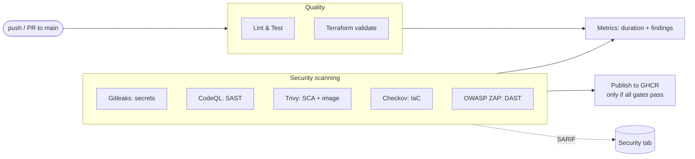
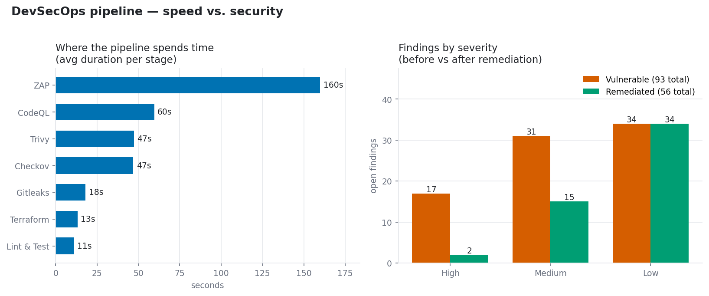

# DevSecOps Pipeline Demo

> A deliberately insecure Flask app, secured through a GitHub Actions DevSecOps pipeline.

[](https://github.com/BohdanPanasenko/devsecops-pipeline-demo/actions/workflows/ci.yml)

> ℹ️ **The badge shows "failing" on purpose.** The pipeline enforces security gates,
> and the app ships with vulnerabilities that were planted deliberately, so the gates
> correctly block the build. A red pipeline here means the checks are doing their job.
> See [Gate policy](#gate-policy) and [SEEDED_VULNS.md](SEEDED_VULNS.md).

---

## What this is

A small web app that acts as a testbed for running security checks across the whole
software lifecycle (the DevSecOps idea):

- **Development:** SAST (CodeQL), secret scanning (Gitleaks), lint and tests
- **Testing:** DAST against the running app (OWASP ZAP)
- **Deployment:** the things you'd actually ship get scanned (the container image with
  Trivy, the infrastructure code with Checkov), and then a security-gated publish
  releases the image to GitHub Container Registry (GHCR), but only if every gate
  passes. While the seeded vulnerabilities block the build, that step is skipped, so
  the pipeline won't release insecure code.
- **Design:** threat identification and OWASP mapping ([THREAT_MODEL.md](THREAT_MODEL.md))

Actually applying the Terraform to a real cloud is out of scope on purpose. It's
scanned but never applied, so there are no cloud credentials in this public repo. The
"deployment" here means publishing the scanned container image to GHCR, which uses
the built-in token and needs no credentials. It's gated on security, not a live rollout.

The app is tiny on purpose. The real value is the pipeline around it: security
scanners, enforced gates, all findings collected in GitHub's Security tab, and per-run
metrics for a speed-vs-security look.

## The two branches: `main` vs `remediated`

The demo lives on two branches, and the rest of this README refers to both:

- **`main`** keeps the seeded vulnerabilities, so its pipeline is **red** (the gates
  block it). That's the detection and enforcement side.
- **`remediated`** fixes all six, so its pipeline is **green** and the gated `publish`
  job runs, releasing the image to
  [GHCR&nbsp;Packages](https://github.com/BohdanPanasenko/devsecops-pipeline-demo/pkgs/container/devsecops-pipeline-demo).

## Pipeline overview

Every push and pull request to `main` runs the pipeline. Seven quality and security
jobs run in parallel, then a metrics job and a security-gated publish:



Each layer of the stack has its own check: secrets -> your code -> dependencies -> infrastructure -> the running app.

## Security stages: what each does and why

| Stage | Tool | What it checks | Why |
|-------|------|----------------|-----|
| **Secret scan** | Gitleaks | Full git history for hardcoded credentials | Leaked keys give instant access, so it's worth catching them early |
| **SAST** | CodeQL | Your source code for vulnerable patterns (e.g. SQL injection) | Finds bugs in code you wrote, by following untrusted input to dangerous spots |
| **SCA + image** | Trivy | Dependencies and the Docker image for known CVEs | You inherit vulnerabilities from third-party code and base images |
| **IaC scan** | Checkov | Terraform for insecure cloud settings | Catches misconfigurations (like a public S3 bucket) before anything is deployed |
| **DAST** | OWASP ZAP | The running app, attacked from the outside | Finds runtime problems (XSS, injection, missing headers) you only see when it's live |

There are also a few supporting jobs: **Lint & Test** (ruff + pytest), **Terraform
validate**, the **Metrics** job (below), and the **security-gated `publish`** that
releases the image to GHCR only when every gate passes.

## Gate policy

The pipeline fails the build on high or critical findings, and just warns on medium.
Each scanner reports severity a little differently (Trivy has CVSS levels, Checkov is
pass/fail, CodeQL and ZAP report into the Security tab), so the policy is applied per
tool. The full breakdown is in [GATE_POLICY.md](GATE_POLICY.md).

## Security reporting (SARIF)

All five scanners write their findings as **SARIF**, a standard format GitHub
understands, and upload it to the **Security > Code scanning** tab. That way you see
secrets, SAST, SCA, IaC, and DAST findings in one place, each tagged with a severity
and linked to the line or URL it came from.

How it works (see `ci.yml`): each job creates its SARIF and uploads it with
`if: always()`, so findings still show up even when the gate fails, and the job is
given `security-events: write` permission. Four of the tools fit neatly because their
findings point at a file and line. ZAP (DAST) points at URLs instead, so a small
converter ([`scripts/zap_to_sarif.py`](scripts/zap_to_sarif.py)) turns its output into
SARIF. That gap is a nice detail on its own: code scanning is really built around
findings that live in source code.

## Software Bill of Materials (SBOM)

The Trivy job also produces a **CycloneDX SBOM** (`sbom.cdx.json`), a machine-readable
list of every OS and Python package inside the container image, saved as a build
artifact on each run. SBOMs are increasingly expected for supply-chain transparency:
with one, you can just search the list to answer "is my image affected by CVE-X?"
instead of guessing.

## Signing and provenance (supply chain)

On the green path, the `publish` job doesn't just push the image. It also signs it and
records how it was built, so whoever deploys it can trust it:

- **Cosign** signs the image without a stored key. It uses GitHub's OIDC identity
  instead, so there's no signing key to leak. The signature effectively says "built
  and signed by this repo's CI workflow," and it's recorded in a public log.
- **SLSA provenance** (via `actions/attest-build-provenance`) attaches a signed record
  of the build: which repo, commit, and workflow produced the image.
- The job then runs `cosign verify` as a deploy-time check, so only a properly signed
  image passes.

This only runs on the `remediated` branch, because you only sign images that cleared
every gate. It's the last piece of the supply-chain story: the SBOM says what's inside,
the signature says it's authentic, the provenance says where it came from, and the
verify step confirms all that before the image is trusted for deploy.

Verify it yourself:

```bash
gh attestation verify oci://ghcr.io/bohdanpanasenko/devsecops-pipeline-demo:latest \
  --repo BohdanPanasenko/devsecops-pipeline-demo
```

## Seeded vulnerabilities

Six vulnerabilities are planted on purpose. Each one is written up in
[SEEDED_VULNS.md](SEEDED_VULNS.md) with the scanner that should catch it and how
serious it is. A couple stand out:

- **#1 SQL injection** and **#6 reflected XSS** are caught by *both* CodeQL (reading
  the code) and ZAP (attacking the running app), so you see the same flaw found two
  different ways.
- **#5 broken access control** is the deliberate blind spot: a real, high-impact flaw
  that no scanner catches, because it's business logic. It's a reminder that automated
  scanning helps but doesn't replace human review and threat modeling. A fully green
  pipeline could still ship this one.

## Penetration testing

The penetration testing here is automated, done by the **ZAP active scan** (`zap-full-scan.py`).
Unlike a passive scan, it actually fires attack payloads at the running app, so it
exploits real flaws rather than just noting them. It confirms the SQL injection (#1)
and reflected XSS (#6) by attacking them at runtime, which is why those two show up
from both ZAP and CodeQL. Each exploited flaw is written up in
[SEEDED_VULNS.md](SEEDED_VULNS.md).

## Metrics (speed vs. security)

A `metrics` job adds one row per run to `metrics.csv` on a separate
[`metrics`](../../tree/metrics) branch: per-stage duration, total pipeline time, and
findings by severity. This is the data behind the speed-vs-security analysis, and it
already shows the heavier scanners (DAST around 160s, SAST around 58s) taking most of
the time while the lighter ones finish in seconds.

Render the chart from the collected data:

```bash
git show origin/metrics:metrics.csv > metrics.csv
pip install matplotlib
python scripts/plot_metrics.py            # writes metrics.png
```

For example: the vulnerable `main` build has **93 findings (17 high)**, while the
remediated build has **56 (2 high)**. Fixing the seeded vulns clearly drops the
high-severity count, and ZAP's active scan stays the slowest part either way.



*Snapshot from `metrics.csv`, 21 pipeline runs, as of 2026-07-22 (`metrics` branch
`8f05bc2`). You can regenerate it anytime with the commands above.*

## Maintenance

Keeping the app secure over time, not just at one commit, is its own topic, written up
in [MAINTENANCE.md](MAINTENANCE.md): fix timelines by severity, when the base image is
refreshed, what to do if a secret leaks, and a weekly scheduled re-scan so new CVEs
surface even when nobody has pushed.

**Dependabot** ([`.github/dependabot.yml`](.github/dependabot.yml)) opens
weekly PRs to update outdated or vulnerable pip packages and GitHub Actions. It's the
fix side that pairs with Trivy's detection (for example, it proposes bumping the
intentionally old `urllib3` from seeded vuln #3).

## Running locally

```bash
# App (via Docker)
docker compose up -d          # http://127.0.0.1:5000  (login: alice / password123)

# Or directly
python -m venv .venv && .venv/Scripts/pip install -r requirements.txt -r requirements-dev.txt
python app.py

# Tests & lint
pytest -q
ruff check .
```

## Tech stack

Python, Flask, SQLite, gunicorn, Docker / docker-compose, Terraform (AWS S3, scan-only,
never deployed), GitHub Actions, Gitleaks, CodeQL, Trivy, Checkov, OWASP ZAP.
