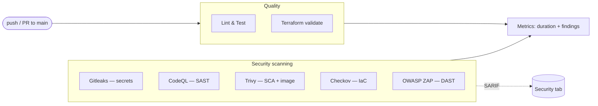

# DevSecOps Pipeline Demo

> A deliberately insecure Flask app secured through a GitHub Actions DevSecOps pipeline.

[](https://github.com/BohdanPanasenko/devsecops-pipeline-demo/actions/workflows/ci.yml)

> ℹ️ **The badge shows "failing" on purpose.** The pipeline enforces security gates,
> and the app ships with *intentionally planted* vulnerabilities — so the gates
> correctly **block the build**. A red pipeline here means the controls are working.
> See [Gate policy](#gate-policy) and [SEEDED_VULNS.md](SEEDED_VULNS.md).

---

## What this is

A minimal web app used as a **vehicle** to demonstrate security controls mapped to
the software lifecycle — the DevSecOps approach:

- **Development** — SAST (CodeQL), secret scanning (Gitleaks), lint & tests
- **Testing** — DAST against the running app (OWASP ZAP)
- **Deployment stage** — the deployable artifacts are scanned (container image via
  Trivy, infrastructure-as-code via Checkov), then a **security-gated publish**
  releases the image to GitHub Container Registry (GHCR) — but **only if every gate
  passes**. While the seeded vulnerabilities block the build, this step is *skipped*:
  the pipeline refuses to release insecure code.
- **Design** — threat identification and OWASP mapping ([THREAT_MODEL.md](THREAT_MODEL.md))

Applying the Terraform to a live cloud is intentionally **out of scope**: it is
*scanned, never applied*, so no cloud credentials live in this public repo. The
"deployment" here is publishing the scanned container image to GHCR (credential-free,
via the built-in token) — gated on security, not a live infrastructure rollout.

The app itself is tiny on purpose. The value is the pipeline around it - security scanners, enforced quality gates, findings centralized in GitHub's Security
tab, and per-run metrics for a **speed-vs-security** analysis.

## Pipeline overview

Every push and pull request to `main` runs eight parallel jobs:



Each layer of the stack has a matching control: **secrets → code → dependencies →
infrastructure → running app.**

## Security stages — what each does and why

| Stage | Tool | What it checks | Why |
|-------|------|----------------|-----|
| **Secret scan** | Gitleaks | Full git history for hardcoded credentials | Leaked keys grant instant access; catch them before they spread |
| **SAST** | CodeQL | Your source code for vulnerable patterns (e.g. SQL injection) | Finds bugs *in code you wrote* by tracing tainted data to dangerous sinks |
| **SCA + image** | Trivy | Dependencies and the Docker image for known CVEs | You inherit vulnerabilities from third-party code and base images |
| **IaC scan** | Checkov | Terraform for insecure cloud configuration | Catches misconfigurations (e.g. a public S3 bucket) *before* deploy |
| **DAST** | OWASP ZAP | The *running* app, attacked from the outside | Finds runtime flaws (XSS, injection, headers) only visible when live |

Two supporting jobs round it out: **Lint & Test** (ruff + pytest) and **Terraform
validate** (format + validity), plus a **Metrics** job (below).

## Gate policy

The pipeline **fails the build on high/critical findings** and **warns on medium**.
Because each scanner expresses severity differently (Trivy has CVSS levels, Checkov
is pass/fail, CodeQL/ZAP live in the Security tab), the policy is applied per tool.
Full details and the per-tool mapping: [GATE_POLICY.md](GATE_POLICY.md).

## Security reporting (SARIF)

All five scanners emit their findings as **SARIF** — an industry-standard format —
which is uploaded to GitHub's **Security → Code scanning** tab. This gives one
unified dashboard for secrets, SAST, SCA, IaC, and DAST findings, each severity-
tagged and linked to the offending line/URL.

The pattern (see `ci.yml`): each job generates SARIF, then uploads it with
`if: always()` so findings publish *even when the gate fails*, using a job-level
`security-events: write` permission. Four tools map cleanly (their findings are
source-anchored); ZAP (DAST) is URL-based, so a small converter
([`scripts/zap_to_sarif.py`](scripts/zap_to_sarif.py)) maps it into SARIF —
illustrating that code-scanning is built around static, source-located findings.

## Seeded vulnerabilities

Six vulnerabilities are planted on purpose, each documented in
[SEEDED_VULNS.md](SEEDED_VULNS.md) with the scanner that catches it and the expected
severity. Notably:

- **#1 SQL injection** and **#6 reflected XSS** are caught by **both** CodeQL
  (statically) and ZAP (dynamically) — SAST and DAST converging on the same flaw
  from opposite ends.
- **#5 broken access control** is the deliberate **blind spot**: a real, high-impact
  authorization flaw that **no scanner catches**, because it's business logic. It
  demonstrates that automated scanning *complements* — never *replaces* — human
  review and threat modeling. A fully green pipeline would still ship this flaw.

## Metrics (speed vs. security)

A `metrics` job appends one row per run to `metrics.csv` on a dedicated
[`metrics`](../../tree/metrics) branch: per-stage duration, total pipeline time, and
findings-by-severity. This is the data backbone for the speed-vs-security analysis —
early data already shows the *deep* scanners (DAST, SAST) dominate runtime while the
lightweight ones finish in seconds.

## Running locally

```bash
# App (via Docker)
docker compose up -d          # http://127.0.0.1:5000  (login: alice / password123)

# Or directly
python -m venv .venv && .venv/Scripts/pip install -r requirements.txt -r requirements-dev.txt
python app.py

# Tests & lint
pytest -q
ruff check .
```

## Tech stack

Python · Flask · SQLite · gunicorn · Docker / docker-compose · Terraform (AWS S3,
scan-only — never deployed) · GitHub Actions · Gitleaks · CodeQL · Trivy · Checkov ·
OWASP ZAP.
